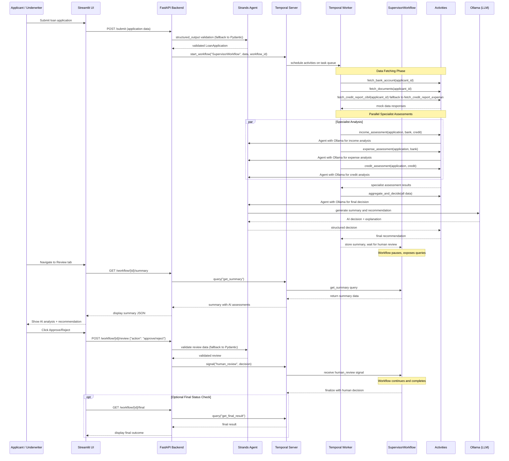

# Agentic Loan Underwriter Demo

This repository demonstrates an agentic loan underwriting system built with Temporal workflows, Strands agent orchestration, Ollama LLM integration, and a Streamlit UI. The system simulates a loan underwriter copilot with specialist agents and supervisor orchestration for automated loan processing with human review capabilities.

## Architecture
- **FastAPI Backend**: REST API with endpoints for loan submission, workflow status checking, and human review
- **Temporal Workflows**: SupervisorWorkflow orchestrates the entire loan processing pipeline
- **Specialist Activities**: Mock data fetching (bank, documents, credit) and AI-powered assessments (income, expense, credit analysis)
- **Strands Integration**: Agent orchestration with structured output validation using Ollama models
- **Streamlit UI**: User interface for loan submission and underwriter review workflow
- **Environment Configuration**: Configurable Ollama and Temporal settings via `.env` file

## Sequence diagram
The diagram below shows the end-to-end flow: user submits via Streamlit, Streamlit calls FastAPI which starts a Temporal workflow. A worker executes activities (mock APIs and specialist agents), the workflow calls Ollama for a summary/decision, then the system awaits a human-review signal. The underwriter approves/rejects via the UI which signals the running workflow.



## Prerequisites
- **Temporal Server**: Running locally (default at localhost:7233)
- **Ollama**: Local installation with model (default: `llama3.2:1b`, configurable via `.env`)
- **Python 3.9+**: Required for all dependencies
- **Dependencies**: Install from `requirements.txt`

## Setup & Installation

1. **Clone and setup environment:**
```bash
git clone <repository-url>
cd temporal-agentic--loan-underwriter
python -m venv .venv
source .venv/bin/activate  # On Windows: .venv\Scripts\activate
pip install -r requirements.txt
```

2. **Configure environment variables:**
```bash
cp .env.example .env
# Edit .env to customize Ollama URL, model, and Temporal settings
```

3. **Start required services:**
   - Start Temporal server (see [Temporal docs](https://docs.temporal.io/dev-guide/))
   - Start Ollama with your preferred model (e.g., `ollama run llama3.2:1b`)

4. **Launch the application:**

   **Terminal 1 - Temporal Worker:**
   ```bash
   python backend/worker.py
   ```

   **Terminal 2 - FastAPI Backend:**
   ```bash
   uvicorn backend.main:app --reload --port 8000
   ```

   **Terminal 3 - Streamlit UI:**
   ```bash
   streamlit run ui/streamlit_app.py
   ```

5. **Access the application:**
   - Streamlit UI: http://localhost:8501
   - FastAPI docs: http://localhost:8000/docs

## Key Features
- **Structured Data Validation**: Strands integration provides automatic validation of loan applications
- **Mock Data Services**: Simulated bank account, document, and credit report fetching
- **AI-Powered Analysis**: Specialist agents for income, expense, and credit assessment using Ollama
- **Human-in-the-Loop**: Workflow pauses for human underwriter review and decision
- **Durable Execution**: Temporal ensures reliable workflow execution with automatic retries
- **Real-time UI**: Streamlit interface for application submission and review workflow

## Project Structure
```
├── backend/
│   ├── main.py          # FastAPI application and API endpoints
│   ├── workflows.py     # Temporal SupervisorWorkflow definition
│   ├── activities.py    # Temporal activities (data fetching & AI assessments)
│   └── worker.py        # Temporal worker process
├── ui/
│   └── streamlit_app.py # Streamlit user interface
├── .env.example         # Environment configuration template
└── requirements.txt     # Python dependencies
```

## Development Notes
- Uses mock data for external integrations (bank, documents, credit reports)
- Strands agent fallback: system gracefully handles Strands initialization failures
- Configurable Ollama model selection via environment variables
- Production deployment would require secure API integrations and authentication
- Workflow supports binary approve/reject decisions with AI-generated explanations

## Contributing

We welcome contributions to improve this demo! Here's how you can help:

### Getting Started
1. Fork the repository
2. Create a feature branch: `git checkout -b feature/your-feature-name`
3. Make your changes and test locally
4. Commit with clear messages: `git commit -m "Add: description of changes"`
5. Push to your fork: `git push origin feature/your-feature-name`
6. Open a Pull Request with a clear description of your changes

### Contribution Ideas
- **Enhanced AI Models**: Integration with other LLM providers (OpenAI, Anthropic, etc.)
- **Real Integrations**: Replace mock activities with actual bank/credit APIs
- **UI Improvements**: Enhanced Streamlit interface or alternative frontend
- **Security Features**: Authentication, authorization, and data encryption
- **Testing**: Unit tests, integration tests, and workflow testing
- **Documentation**: API documentation, deployment guides, or tutorials
- **Performance**: Optimization and monitoring capabilities

### Code Standards
- Follow existing code style and patterns
- Add appropriate error handling and logging
- Update documentation for any new features
- Ensure all tests pass before submitting

## License

This project is licensed under the MIT License - see the [LICENSE](LICENSE) file for details.

Copyright (c) 2025 Darshit Vora

Permission is hereby granted, free of charge, to any person obtaining a copy of this software and associated documentation files (the "Software"), to deal in the Software without restriction, including without limitation the rights to use, copy, modify, merge, publish, distribute, sublicense, and/or sell copies of the Software, and to permit persons to whom the Software is furnished to do so, subject to the following conditions:

The above copyright notice and this permission notice shall be included in all copies or substantial portions of the Software.
