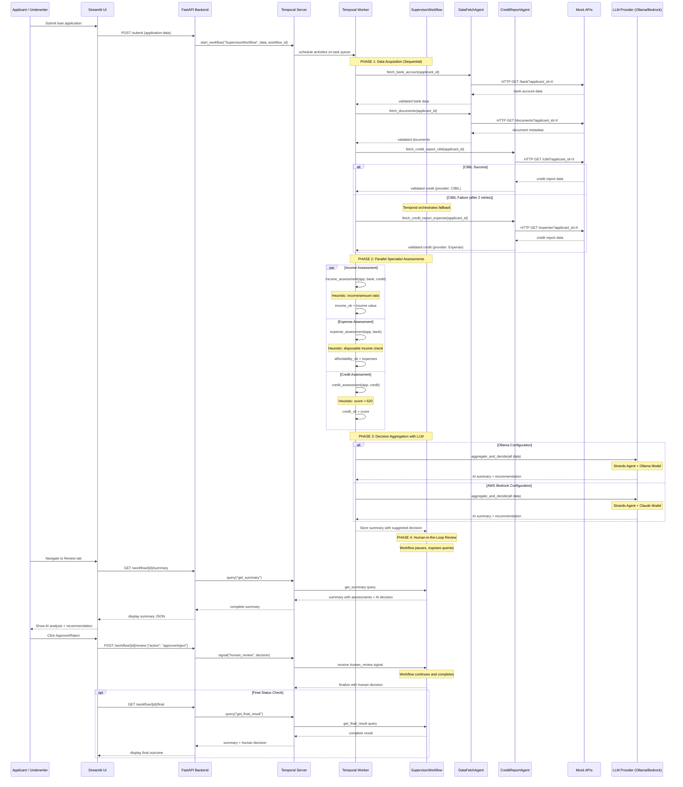

# Agentic Loan Underwriter Demo

This repository demonstrates an agentic loan underwriting system built with Temporal workflows, Strands agent orchestration, Ollama LLM integration, and a Streamlit UI. The system simulates a loan underwriter copilot with specialist agents and supervisor orchestration for automated loan processing with human review capabilities.

## Architecture
- **FastAPI Backend**: REST API with endpoints for loan submission, workflow status checking, and human review
- **Temporal Workflows**: SupervisorWorkflow orchestrates the entire loan processing pipeline with durable execution
  - Supports both **local Temporal** (default) and **Temporal Cloud** with API key authentication
  - Automatic connection detection based on environment variables
- **Strands HTTP Agents**: Reusable agent classes for intelligent data fetching with error handling and validation
  - `DataFetchAgent`: Generic HTTP data fetching with validation
  - `CreditReportAgent`: Specialized credit report validation with multi-provider support
- **Specialist Activities**: Mock data fetching (bank, documents, credit) and AI-powered assessments (income, expense, credit analysis)
- **Strands Integration**: Agent orchestration with structured output validation using Ollama or AWS Bedrock models
- **Provider Fallback**: Temporal-orchestrated fallback from CIBIL to Experian for credit reports
- **Streamlit UI**: User interface for loan submission and underwriter review workflow
- **Environment Configuration**: Configurable LLM settings (Ollama/AWS Bedrock) and Temporal settings (Local/Cloud) via `.env` file

## Sequence diagram
The diagram below shows the end-to-end flow: user submits via Streamlit, Streamlit calls FastAPI which starts a Temporal workflow. A worker executes activities (mock APIs and specialist agents), the workflow calls Ollama for a summary/decision, then the system awaits a human-review signal. The underwriter approves/rejects via the UI which signals the running workflow.



## Prerequisites
- **Temporal Server** (choose one):
  - **Local Temporal** (default): Running locally at localhost:7233
  - **Temporal Cloud**: Account with API key for cloud-hosted Temporal
- **LLM Provider** (one of the following):
  - **Ollama**: Local installation with model (default: `llama3:latest`, configurable via `.env`)
  - **AWS Bedrock**: Access to AWS Bedrock service with API key and supported models (e.g., `au.anthropic.claude-sonnet-4-5-20250929-v1:0`)
- **Mockoon**: Mock API server running on port 3233 (configuration available in `mockoon` folder)
- **Python 3.9+**: Required for all dependencies
- **Dependencies**: Install from `requirements.txt`

## Setup & Installation

1. **Clone and setup environment:**
```bash
git clone <repository-url>
cd temporal-agentic--loan-underwriter
python -m venv .venv
source .venv/bin/activate  # On Windows: .venv\Scripts\activate
pip install -r requirements.txt
```

2. **Configure environment variables:**
```bash
cp .env.example .env
# Edit .env to configure Temporal and LLM provider settings:

# Temporal Configuration:
# For Local (default):
TEMPORAL_ADDRESS=localhost:7233
TEMPORAL_NAMESPACE=default
TEMPORAL_TASK_QUEUE=loan-underwriter-queue

# For Temporal Cloud (just add API key and update address/namespace):
# TEMPORAL_API_KEY=your-api-key-here
# TEMPORAL_ADDRESS=your-namespace.account-id.tmprl.cloud:7233
# TEMPORAL_NAMESPACE=your-namespace.account-id

# LLM Configuration - For Ollama:
MODEL_PROVIDER=ollama
OLLAMA_URL=http://localhost:11434
OLLAMA_MODEL=llama3:latest

# OR for AWS Bedrock:
MODEL_PROVIDER=aws-bedrock
AWS_BEARER_TOKEN_BEDROCK=<your-api-key>
AWS_REGION=<your-region>  # e.g., ap-southeast-2
AWS_BEDROCK_MODEL=<model-id>  # e.g., au.anthropic.claude-sonnet-4-5-20250929-v1:0
```

3. **Start required services:**

   **Temporal Server** (choose one):
   - **Local Temporal (default)**: Start local Temporal server (see [Temporal docs](https://docs.temporal.io/dev-guide/))
   - **Temporal Cloud**: Configure API key in `.env` - no local server needed

   **LLM Provider** (choose one):
   - **Ollama**: Start Ollama with your preferred model (e.g., `ollama run llama3.2:1b`)
   - **AWS Bedrock**: Configure API key in `.env` - no local service needed

   **Mock APIs**:
   - Start Mockoon with the configuration from the `mockoon` folder (import the JSON config file into Mockoon and start the mock API on port 3233)

4. **Launch the application:**

   **Terminal 1 - Temporal Worker:**
   ```bash
   python backend/worker.py
   ```

   **Terminal 2 - FastAPI Backend:**
   ```bash
   uvicorn backend.main:app --reload --port 8000
   ```

   **Terminal 3 - Streamlit UI:**
   ```bash
   streamlit run ui/streamlit_app.py
   ```

5. **Access the application:**
   - Streamlit UI: http://localhost:8501
   - FastAPI docs: http://localhost:8000/docs

## Temporal Cloud Configuration

The application supports both local Temporal and Temporal Cloud deployments. By default, it connects to a local Temporal server.

### Switching to Temporal Cloud

To use Temporal Cloud instead of a local server:

1. **Obtain Temporal Cloud credentials:**
   - Sign up for [Temporal Cloud](https://temporal.io/cloud)
   - Create a namespace (e.g., `my-namespace.account-id`)
   - Generate an API key from the Temporal Cloud console

2. **Update your `.env` file:**
   ```bash
   # Update the address and namespace for your Temporal Cloud instance
   TEMPORAL_ADDRESS=my-namespace.account-id.tmprl.cloud:7233
   TEMPORAL_NAMESPACE=my-namespace.account-id
   TEMPORAL_TASK_QUEUE=loan-underwriter-queue

   # Add your API key
   TEMPORAL_API_KEY=your-actual-api-key-here
   ```

3. **Connection Detection:**
   - The application uses the same `TEMPORAL_ADDRESS` and `TEMPORAL_NAMESPACE` for both local and cloud
   - If `TEMPORAL_API_KEY` is set, it automatically enables TLS and API key authentication for cloud
   - If `TEMPORAL_API_KEY` is not set, it connects to local Temporal without authentication

4. **Restart your services:**
   - Stop any running worker and FastAPI processes
   - Start them again - they will automatically connect to Temporal Cloud

### Temporal Cloud Benefits

- **Zero infrastructure management**: No need to run local Temporal server
- **High availability**: Built-in redundancy and failover
- **Scalability**: Auto-scaling workers and workflow capacity
- **Security**: TLS encryption and API key authentication
- **Monitoring**: Built-in observability and metrics

## Key Features
- **Structured Data Validation**: Strands integration provides automatic validation of loan applications
- **Mock Data Services**: Simulated bank account, document, and credit report fetching
- **AI-Powered Analysis**: Specialist agents for income, expense, and credit assessment using Ollama
- **Human-in-the-Loop**: Workflow pauses for human underwriter review and decision
- **Durable Execution**: Temporal ensures reliable workflow execution with automatic retries
- **Real-time UI**: Streamlit interface for application submission and review workflow

## Project Structure
```
├── backend/
│   ├── main.py                              # FastAPI application and API endpoints
│   ├── workflows.py                         # Temporal SupervisorWorkflow definition
│   ├── activities.py                        # Temporal activities (data fetching & AI assessments)
│   ├── worker.py                            # Temporal worker process
│   ├── classes/
│   │   └── agents/
│   │       ├── data_fetch_agent.py          # Strands agent for HTTP data fetching
│   │       └── credit_report_agent.py       # Strands agent for credit report validation
│   └── utilities/
│       └── temporal_client.py               # Temporal connection utility (local/cloud)
├── ui/
│   └── streamlit_app.py                     # Streamlit user interface
├── mockoon/                                 # Mock API configuration for local development
├── .env.example                             # Environment configuration template
└── requirements.txt                         # Python dependencies
```

## Development Notes
- **Mock Data Services**: Uses Mockoon for simulating bank, document, and credit bureau APIs
- **Agent Architecture**: Strands agents are organized in reusable classes under `backend/classes/agents/`
- **Separation of Concerns**:
  - Temporal activities handle durable execution and retry logic (outer loop)
  - Strands agents handle intelligent data fetching and validation (inner loop)
- **Provider Fallback Pattern**: Temporal workflow orchestrates CIBIL → Experian fallback for credit reports
- **Configurable LLM**: Support for both Ollama (local) and AWS Bedrock (cloud) models via environment variables
- **Production Considerations**: Would require secure API integrations, authentication, and real data providers
- **Human-in-the-Loop**: Workflow supports binary approve/reject decisions with AI-generated explanations

## Contributing

We welcome contributions to improve this demo! Here's how you can help:

### Getting Started
1. Fork the repository
2. Create a feature branch: `git checkout -b feature/your-feature-name`
3. Make your changes and test locally
4. Commit with clear messages: `git commit -m "Add: description of changes"`
5. Push to your fork: `git push origin feature/your-feature-name`
6. Open a Pull Request with a clear description of your changes

### Contribution Ideas
- **Enhanced AI Models**: Integration with other LLM providers (OpenAI, Azure OpenAI, etc.)
- **Real Integrations**: Replace mock activities with actual bank/credit APIs
- **UI Improvements**: Enhanced Streamlit interface or alternative frontend
- **Security Features**: Authentication, authorization, and data encryption
- **Testing**: Unit tests, integration tests, and workflow testing
- **Documentation**: API documentation, deployment guides, or tutorials
- **Performance**: Optimization and monitoring capabilities

### Code Standards
- Follow existing code style and patterns
- Add appropriate error handling and logging
- Update documentation for any new features
- Ensure all tests pass before submitting

## License

This project is licensed under the MIT License - see the [LICENSE](LICENSE) file for details.

Copyright (c) 2025 Darshit Vora

Permission is hereby granted, free of charge, to any person obtaining a copy of this software and associated documentation files (the "Software"), to deal in the Software without restriction, including without limitation the rights to use, copy, modify, merge, publish, distribute, sublicense, and/or sell copies of the Software, and to permit persons to whom the Software is furnished to do so, subject to the following conditions:

The above copyright notice and this permission notice shall be included in all copies or substantial portions of the Software.
