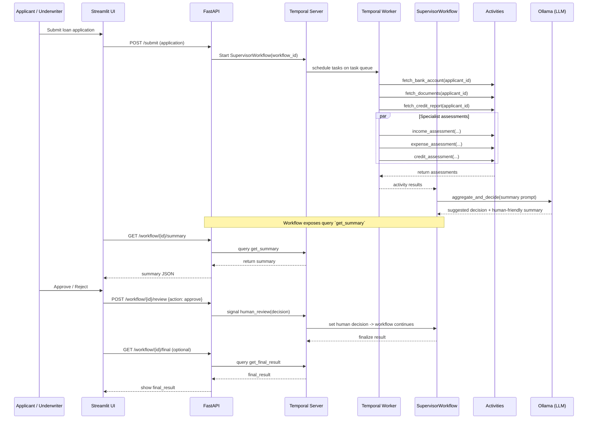

# Agentic Loan Underwriter Demo

This repository contains a minimal demo showing how to orchestrate an agentic system using Temporal (durable workflows), Strands-like agent orchestration, a local Ollama model for LLM responses, and a simple Streamlit UI. The goal is to simulate a loan underwriter copilot with specialist agents and a supervisor orchestrator.

## Architecture
- FastAPI backend exposes endpoints to submit loan applications and check status.
- Temporal workflows (SupervisorWorkflow) orchestrate activities: fetching mock bank data, documents, credit report, specialist assessments, and final aggregation/decision.
- Activities implement the specialist agents and call a local Ollama model for a human-friendly summary.
- Streamlit provides a minimal UI for submitting applications, viewing AI assessments, and making approve/reject decisions.

## Sequence diagram
The diagram below shows the end-to-end flow: user submits via Streamlit, Streamlit calls FastAPI which starts a Temporal workflow. A worker executes activities (mock APIs and specialist agents), the workflow calls Ollama for a summary/decision, then the system awaits a human-review signal. The underwriter approves/rejects via the UI which signals the running workflow.



## Requirements
- Temporal server running locally (default at localhost:7233)
- Ollama running locally (default at http://localhost:11434) with model `deepseek-r1:8b` installed
- Python dependencies in `requirements.txt`

## Quickstart

1. Create a virtualenv and install dependencies:

```bash
python -m venv .venv
source .venv/bin/activate
pip install -r requirements.txt
```

2. Start Temporal server (not included). For local dev use the Temporal quickstart or Docker image.

3. Start the worker to poll the task queue:

```bash
python backend/worker.py
```

4. Run the FastAPI app:

```bash
uvicorn backend.main:app --reload --port 8000
```

5. Run the Streamlit UI:

```bash
streamlit run ui/streamlit_app.py
```

## Notes & next steps
- This is a minimal scaffold. It uses mock activities and simple heuristics. Production would require secure integrations, better error handling, authentication, and enhanced UI for human underwriters.
- You can replace the OllamaClient with Bedrock/Claude as needed — keep activities small and idempotent.
- The system supports binary approve/reject decisions with comprehensive AI explanations to assist human reviewers.
